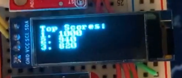
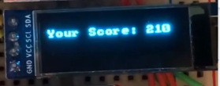
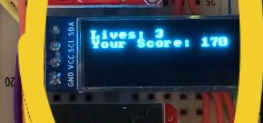
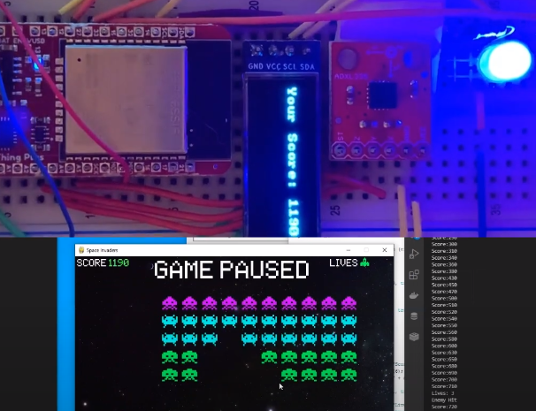
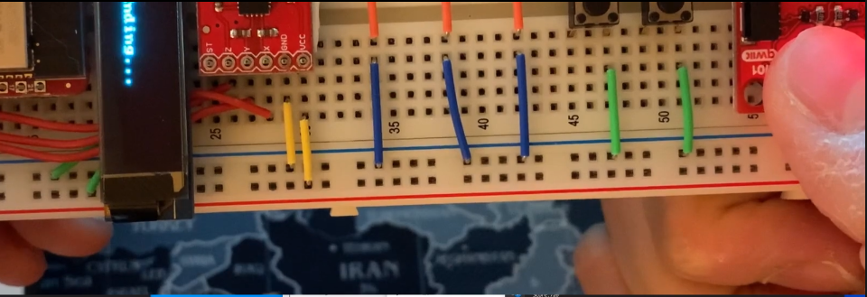

# Space Invader

Customized Space Invade controller project from UCSD.

### **Improvement 1: 3 Levels of Movement**

To move the Space Invader smoother, we had to specify the conditions for sending an orientation from the MCU to the python so the Python can read how much our controller is now tilted while the user is playing the game.

### **Improvement 2: TOP 3 Scores on OLED Before Game Starts / After Game Ends**

To print out the top 3 scores on OLED before the game starts and after the game ends, we needed to stack the scores inside the **csv** file whenever the game ends. Then get a **numpy** array from the **csv** file, compare the values to determine the highest 3 scores.

### **Improvement 3: Current Score On OLED while playing game**

To print out the current score while the user is playing the game, we needed to figure out where the score is calculated in the main game file. There is **check_collision()** function in the main game file, and it checks the collisions between the bullet that the space invader shoots and the enemy or the mystery ship. Every time it checks the collision and calculates the current score, we send a message to MCU to print out the scores on OLED.

### **Improvement 4: Motor Buzzing & Yellow LED Blinks when Enemy Bullet Hits the Ship**

We implemented some arduino codes for the motor buzzing and yellow LED blinking when the Python is sending the data to MCU while the enemy bullet hits the ship during the game.

### **Improvement 5: Remaining Lives Printing on OLED when Enemy Bullet Hits the Ship**

When the game begins, the total lives of the ship is set to be 3. But whenever the enemy bullet hits the space invader ship, the lives are decreasing by 1. If the total lives become to 0, the game is done and restarts soon.

### **Improvement 6: Game Paused/Resumed & Blue LED Blinks**

If we press the right button, the game is paused and the blue LED blinks to let the user know the game is paused. Also, "GAME PAUSED" message pops up to the game monitor as well.

### **Improvement 7: Quit the Game Immediately when PPG Reading Activated**

To put one more of what we've learned throughout the quarter, we added the functionality to quit the game immediately if the **PPG Sensor** reads the higher value than a threshold. Once it detects the value higher than the threshold, the OLED prints out the **Ending...** message and the game is stopped.

### **Youtube Video Link for Game Playing**

Here is the video link of the **YouTube**  
https://www.youtube.com/watch?v=Sr_zmGJQP68
